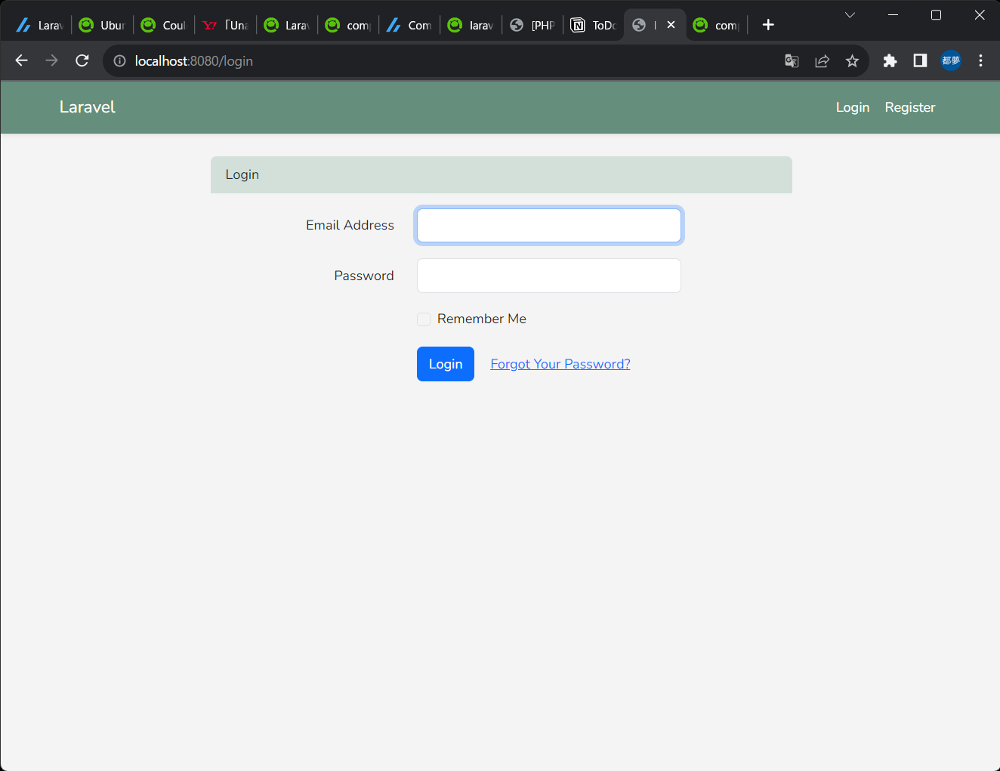
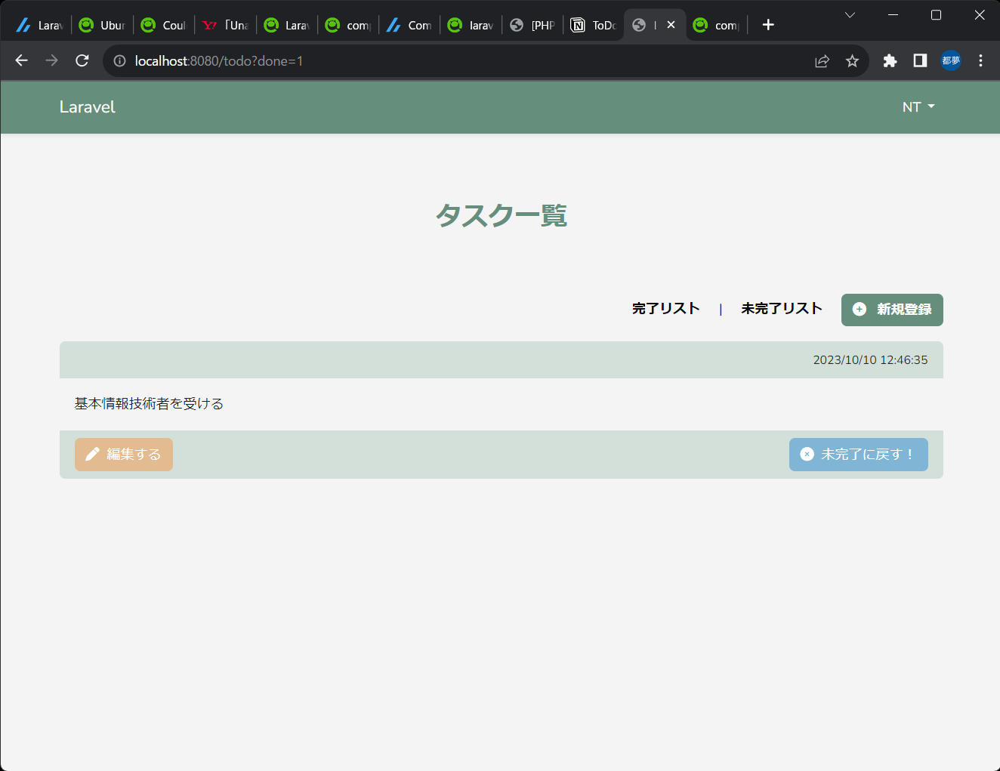

#Laravel Todo管理サイト

今後やりたいことをTodoとして管理するシンプルなサイトです。

タスクは完了したら完了リストに入れられ、再度やることリストに戻すこともできます。

ログイン、登録、削除、編集、完了機能があります。

まだまだLaravelについて理解が足りていないため、レイアウトの変更や機能の変更や追加をする予定です。

#使用技術

・PHP

・Laravel

・Docker

・PostgreSQL

・Sass
